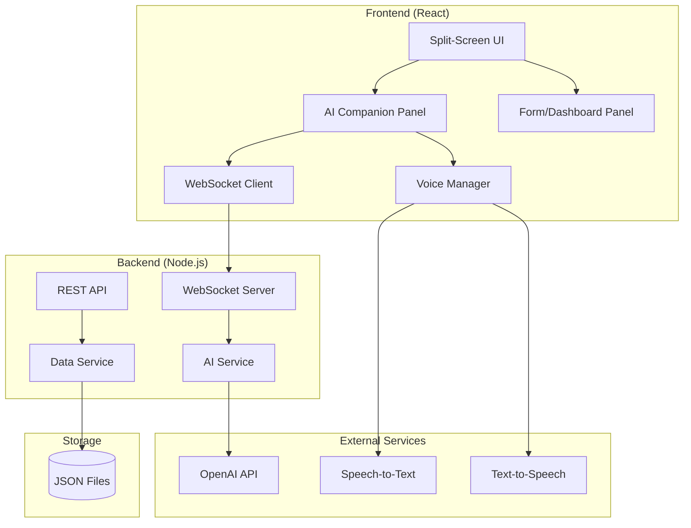

# Design Document - Dove Grants

## Overview

Dove Grants is a modern web application featuring a split-screen conversational interface for grant management. The system consists of two main user experiences:

1. **Applicant Experience**: A conversational AI companion (voice/text) on the left panel guides applicants through the grant application process, while the application form on the right panel auto-populates in real-time based on the conversation.

2. **Administrator Experience**: A split-screen with AI assistant on the left for analysis and recommendations, and a management dashboard on the right for budget tracking, application review, and decision-making.

The application will be built as a TypeScript/React web application with a Node.js backend, using OpenAI APIs for AI capabilities and Web Speech API for voice interaction.

## Architecture



### Technology Stack

- **Frontend**: React 18, TypeScript, TailwindCSS
- **Backend**: Node.js, Express, TypeScript
- **AI Integration**: OpenAI GPT-4 API
- **Voice**: Web Speech API (browser-native STT/TTS)
- **Real-time**: WebSocket for chat streaming
- **Storage**: JSON file-based persistence
- **Testing**: Vitest, fast-check (property-based testing)

## Components and Interfaces

### Frontend Components

```typescript
// Main layout component
interface SplitScreenLayoutProps {
  leftPanel: React.ReactNode;  // AI Companion
  rightPanel: React.ReactNode; // Form or Dashboard
  userRole: 'applicant' | 'admin';
}

// AI Companion chat panel
interface AICompanionProps {
  mode: 'voice' | 'text';
  onFieldUpdate: (field: string, value: string) => void;
  onModeChange: (mode: 'voice' | 'text') => void;
  context: 'application' | 'admin';
}

// Voice interaction manager
interface VoiceManagerProps {
  isListening: boolean;
  onTranscript: (text: string) => void;
  onSpeakComplete: () => void;
}

// Application form (applicant side)
interface ApplicationFormProps {
  formData: ApplicationFormData;
  highlightedField: string | null;
  onManualEdit: (field: string, value: string) => void;
  onSubmit: () => void;
}

// Admin dashboard
interface AdminDashboardProps {
  categories: Category[];
  applications: Application[];
  onFilterChange: (filters: DashboardFilters) => void;
  onApplicationAction: (id: string, action: 'approve' | 'reject') => void;
}
```

### Backend Services

```typescript
// AI Service - handles all AI interactions
interface AIService {
  // Conversational AI for applicants
  processApplicantMessage(
    message: string,
    conversationHistory: Message[],
    currentFormData: Partial<ApplicationFormData>
  ): Promise<AIResponse>;
  
  // Categorize submitted application
  categorizeApplication(
    application: Application,
    categories: Category[]
  ): Promise<CategorizationResult>;
  
  // Rank applications within a category
  rankApplications(
    applications: Application[],
    criteria: RankingCriterion[]
  ): Promise<RankedApplication[]>;
  
  // Generate analysis for admin
  analyzeApplication(application: Application): Promise<ApplicationAnalysis>;
}

// Data Service - handles persistence
interface DataService {
  // Applications
  createApplication(data: ApplicationFormData): Promise<Application>;
  getApplication(id: string): Promise<Application | null>;
  updateApplication(id: string, updates: Partial<Application>): Promise<Application>;
  listApplications(filters?: ApplicationFilters): Promise<Application[]>;
  
  // Categories & Budget
  getCategories(): Promise<Category[]>;
  updateCategory(id: string, updates: Partial<Category>): Promise<Category>;
  getBudgetStatus(): Promise<BudgetStatus>;
  
  // Ranking Criteria
  getCriteria(categoryId?: string): Promise<RankingCriterion[]>;
  saveCriteria(criteria: RankingCriterion[]): Promise<void>;
}
```

## Data Models

```typescript
// Application submitted by applicant
interface Application {
  id: string;
  referenceNumber: string;
  
  // Applicant info
  applicantName: string;
  applicantEmail: string;
  
  // Project details
  projectTitle: string;
  projectDescription: string;
  requestedAmount: number;
  
  // Status tracking
  status: ApplicationStatus;
  submittedAt: Date;
  updatedAt: Date;
  
  // AI categorization
  categoryId: string | null;
  categorizationExplanation: string | null;
  categorizationConfidence: number | null;
  
  // Ranking (populated when ranked)
  rankingScore: number | null;
  rankingBreakdown: CriterionScore[] | null;
  
  // Decision
  decision: 'approved' | 'rejected' | null;
  decisionReason: string | null;
  decidedAt: Date | null;
}

type ApplicationStatus = 
  | 'draft'
  | 'submitted'
  | 'categorized'
  | 'under_review'
  | 'approved'
  | 'rejected';

// Budget category
interface Category {
  id: string;
  name: string;
  description: string;
  allocatedBudget: number;
  spentBudget: number;
  isActive: boolean;
}

// Ranking criterion
interface RankingCriterion {
  id: string;
  name: string;
  description: string;
  weight: number; // 0-100, all weights normalized to sum to 100
  categoryId: string | null; // null = global criterion
}

// Score for a single criterion
interface CriterionScore {
  criterionId: string;
  criterionName: string;
  score: number; // 0-100
  weight: number;
  weightedScore: number;
  reasoning: string;
}

// Budget configuration
interface BudgetConfig {
  fiscalYear: number;
  totalBudget: number;
  categories: Category[];
}

// AI response for conversation
interface AIResponse {
  message: string;
  fieldUpdates: FieldUpdate[];
  isComplete: boolean;
  nextQuestion: string | null;
}

interface FieldUpdate {
  field: string;
  value: string;
  confidence: number;
}

// Categorization result
interface CategorizationResult {
  categoryId: string;
  categoryName: string;
  explanation: string;
  confidence: number; // 0-100
}

// Ranked application
interface RankedApplication {
  application: Application;
  totalScore: number;
  breakdown: CriterionScore[];
  rank: number;
}

// Chat message
interface Message {
  id: string;
  role: 'user' | 'assistant';
  content: string;
  timestamp: Date;
  fieldUpdates?: FieldUpdate[];
}


## Correctness Properties

*A property is a characteristic or behavior that should hold true across all valid executions of a system-essentially, a formal statement about what the system should do. Properties serve as the bridge between human-readable specifications and machine-verifiable correctness guarantees.*

Based on the acceptance criteria analysis, the following properties must hold:

### Property 1: Form field sync consistency
*For any* AI response containing field updates, applying those updates to the form state SHALL result in the form containing exactly those field values.
**Validates: Requirements 1.2, 2.2**

### Property 2: Application validation completeness
*For any* application form data, the validation function SHALL return errors for exactly the set of required fields that are empty or invalid, and return success only when all required fields are valid.
**Validates: Requirements 1.3, 1.4**

### Property 3: Budget allocation invariant
*For any* set of category allocations, the sum of all allocated amounts plus remaining unallocated funds SHALL equal the total yearly budget exactly.
**Validates: Requirements 3.3**

### Property 4: Budget overallocation prevention
*For any* set of category allocations where the sum exceeds the total yearly budget, the save operation SHALL fail and return an appropriate error.
**Validates: Requirements 3.4**

### Property 5: AI categorization output validity
*For any* application that is categorized, the result SHALL contain: a valid category ID from the available categories, a non-empty explanation string, and a confidence score between 0 and 100 inclusive.
**Validates: Requirements 4.1, 4.2, 4.3**

### Property 6: Criteria weight normalization
*For any* set of ranking criteria after normalization, the sum of all weights SHALL equal exactly 100.
**Validates: Requirements 5.3**

### Property 7: Ranking score calculation consistency
*For any* ranked application, the total score SHALL equal the sum of (criterion score × criterion weight / 100) for all criteria, and the list SHALL be sorted in descending order by total score.
**Validates: Requirements 6.1, 6.2, 6.3**

### Property 8: Ranking reasoning completeness
*For any* criterion score in a ranking breakdown, the reasoning field SHALL be a non-empty string.
**Validates: Requirements 6.4**

### Property 9: Budget deduction on approval
*For any* application approval, the category's spent budget SHALL increase by exactly the application's requested amount.
**Validates: Requirements 7.1**

### Property 10: Remaining budget calculation
*For any* category, the remaining budget SHALL equal allocated budget minus spent budget.
**Validates: Requirements 7.3**

### Property 11: Budget warning threshold
*For any* approval where the requested amount exceeds the category's remaining budget, the system SHALL return a warning flag.
**Validates: Requirements 7.4**

### Property 12: Filter result correctness
*For any* filter applied to applications, all returned applications SHALL match the filter criteria (category and/or status).
**Validates: Requirements 8.3**

### Property 13: Budget threshold detection
*For any* category where spent budget divided by allocated budget is greater than or equal to 0.8, the category SHALL be flagged as threshold-reached.
**Validates: Requirements 8.4**

### Property 14: Data serialization round-trip
*For any* valid application, category, or budget configuration object, serializing to JSON and then deserializing SHALL produce an object equivalent to the original.
**Validates: Requirements 9.3**

## Error Handling

### Frontend Errors

| Error Type | Handling Strategy |
|------------|-------------------|
| Voice API unavailable | Display message, auto-switch to text mode |
| WebSocket disconnection | Show reconnecting indicator, queue messages, auto-reconnect |
| Form validation failure | Highlight invalid fields, AI companion prompts for corrections |
| Network timeout | Show retry button, preserve form state |

### Backend Errors

| Error Type | Handling Strategy |
|------------|-------------------|
| AI API failure | Return graceful error message, allow manual input |
| Data parsing error | Log error, return clear message, preserve existing data |
| Budget constraint violation | Return specific error with current budget state |
| Invalid state transition | Return allowed transitions in error response |

### Error Response Format

```typescript
interface ErrorResponse {
  success: false;
  error: {
    code: string;
    message: string;
    details?: Record<string, unknown>;
  };
}
```

## Testing Strategy

### Unit Testing

Unit tests will cover:
- Form validation logic
- Budget calculations (allocation, remaining, threshold detection)
- Criteria weight normalization
- Ranking score calculations
- Data serialization/deserialization
- Filter logic

### Property-Based Testing

Property-based tests will be implemented using **fast-check** library for TypeScript. Each test will run a minimum of 100 iterations.

Properties to test:
1. Form field sync (Property 1)
2. Validation completeness (Property 2)
3. Budget invariants (Properties 3, 4)
4. AI output validity (Property 5)
5. Weight normalization (Property 6)
6. Ranking calculations (Properties 7, 8)
7. Budget operations (Properties 9, 10, 11)
8. Filtering (Property 12)
9. Threshold detection (Property 13)
10. Serialization round-trip (Property 14)

Each property-based test will be tagged with:
```typescript
// **Feature: grant-manager, Property {number}: {property_text}**
```

### Integration Testing

- AI Companion conversation flow with form population
- Application submission end-to-end
- Admin approval/rejection workflow
- Budget tracking across multiple operations

### Test File Structure

```
src/
├── models/
│   ├── application.ts
│   ├── application.test.ts
│   ├── application.property.test.ts
│   ├── category.ts
│   ├── category.test.ts
│   └── category.property.test.ts
├── services/
│   ├── validation.ts
│   ├── validation.test.ts
│   ├── validation.property.test.ts
│   ├── budget.ts
│   ├── budget.test.ts
│   ├── budget.property.test.ts
│   ├── ranking.ts
│   ├── ranking.test.ts
│   └── ranking.property.test.ts
└── utils/
    ├── serialization.ts
    ├── serialization.test.ts
    └── serialization.property.test.ts
```
